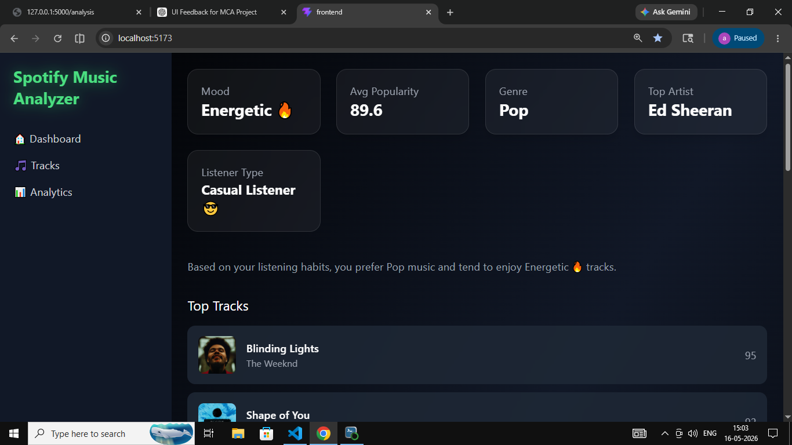
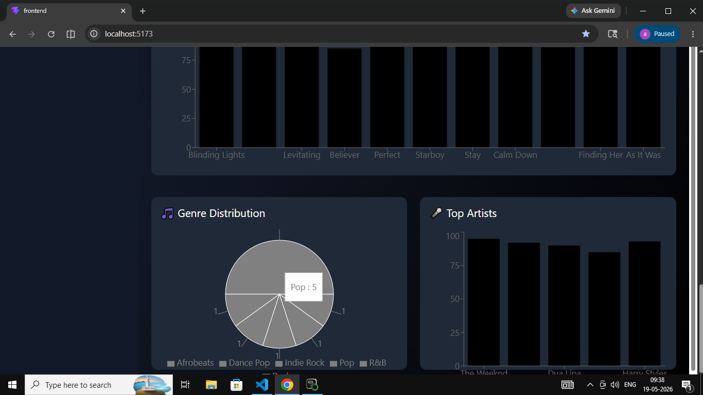
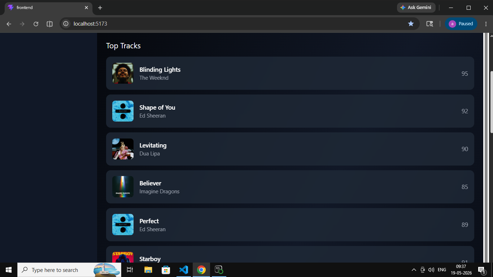

# 🎵 Spotify Music Analyzer

A full-stack web application for analyzing and visualizing music data through an interactive dashboard.

## 📌 Project Overview

Spotify Music Analyzer is a web application developed as part of our MCA Python Full Stack project.

The application provides an interactive interface for exploring music-related data and presenting insights through charts and visualizations.

The project combines a **React + TypeScript frontend** with a **Python Flask backend**.

## 🚀 Features

- 🎵 Music analysis dashboard
- 📊 Interactive charts and visualizations
- 🎧 Track and music data presentation
- 📈 Data-driven insights
- 🖥️ Responsive user interface
- 🔐 User authentication interface
- ⚡ React-based frontend
- 🐍 Flask-based backend
### Dashboard


### Music analyzer


### Playlist


## 🛠️ Technologies Used

### Frontend

- React
- TypeScript
- Vite
- Tailwind CSS
- Recharts

### Backend

- Python
- Flask
- Flask-CORS
- Spotipy

### Tools

- Git
- GitHub
- VS Code

## 📂 Project Structure

```text
Spotify-music-analyzer/
│
├── backend/
│   ├── app.py
│   └── .gitignore
│
├── frontend/
│   ├── public/
│   ├── src/
│   ├── package.json
│   ├── vite.config.ts
│   └── ...
│
├── screenshots/
│
├── README.md
└── .gitattributes